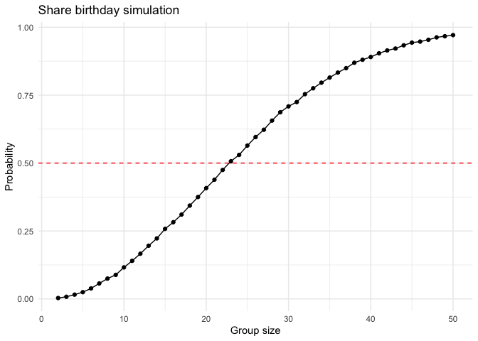
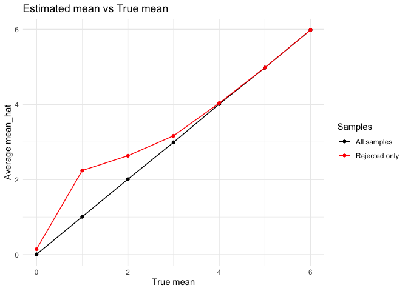
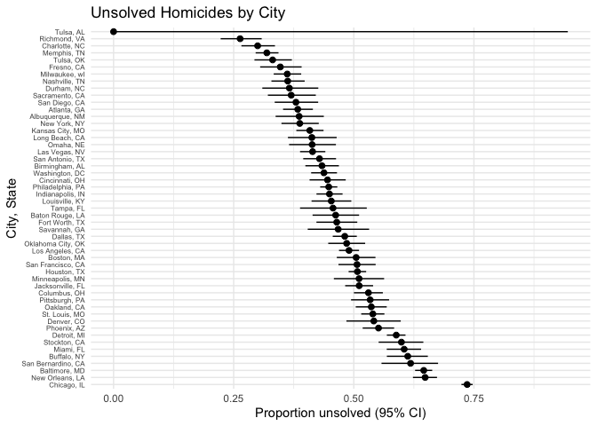

p8105_hw5_xl3054
================
Xinhui Lin
2025-11-05

# Problem 1

``` r
# write function
set.seed(123)
duplicate_bd = function(n) {
  bdays = sample(1:365, size = n, replace = TRUE)  ## uniform distributed between 1-365
  return(any(duplicated(bdays)))  ## returns TRUE or FALSE for duplicate birthdays
}

# calculate probability - at least two people share
group_size = 2:50
prob_dup = numeric(length(group_size))

for (i in 1:length(group_size)) {
  n = group_size[i]
  count = 0
  for (j in 1:10000){
    if(duplicate_bd(n)){
      count = count+1
    }
  }
  prob_dup[i] = count/10000
}
prob_dup
```

    ##  [1] 0.0033 0.0079 0.0158 0.0248 0.0387 0.0570 0.0749 0.0885 0.1160 0.1402
    ## [11] 0.1665 0.1958 0.2228 0.2578 0.2824 0.3105 0.3434 0.3750 0.4079 0.4388
    ## [21] 0.4747 0.5067 0.5301 0.5644 0.5958 0.6226 0.6564 0.6871 0.7088 0.7246
    ## [31] 0.7537 0.7753 0.7959 0.8147 0.8331 0.8494 0.8693 0.8803 0.8905 0.9040
    ## [41] 0.9146 0.9216 0.9335 0.9434 0.9471 0.9537 0.9627 0.9669 0.9710

``` r
# plot
library(tidyverse)
```

    ## ── Attaching core tidyverse packages ──────────────────────── tidyverse 2.0.0 ──
    ## ✔ dplyr     1.1.4     ✔ readr     2.1.5
    ## ✔ forcats   1.0.0     ✔ stringr   1.5.1
    ## ✔ ggplot2   3.5.2     ✔ tibble    3.3.0
    ## ✔ lubridate 1.9.4     ✔ tidyr     1.3.1
    ## ✔ purrr     1.1.0     
    ## ── Conflicts ────────────────────────────────────────── tidyverse_conflicts() ──
    ## ✖ dplyr::filter() masks stats::filter()
    ## ✖ dplyr::lag()    masks stats::lag()
    ## ℹ Use the conflicted package (<http://conflicted.r-lib.org/>) to force all conflicts to become errors

``` r
data.frame(group_size = group_size, prob_dup = prob_dup) %>% 
  ggplot(aes(x = group_size, y = prob_dup)) +
  geom_line() +
  geom_point() +
  geom_hline(yintercept = 0.5, linetype = "dashed", color = "red") +
  labs(x = "Group size", y = "Probability", title = "Share birthday simulation") +
  theme_minimal()
```

<!-- -->

In general, the simulation shows the probability of at least two people
have the same birthday increases as group size increases. The group size
does not need to be very large to have repeated birthdays. The results
show that we only need around 23 people in a room to have a probability
of 0.5 of two people sharing a birthday. When the group size reaches
around 40, the probability is above 0.9, and when 50, the probability is
0.97, very close to 1.

# Problem 2

``` r
n = 30
sigma = 5
mu = 0
results = data.frame()

set.seed(123)
for (i in 1:5000) {
  x = rnorm(n, mean = mu, sd = sigma)
  test = broom::tidy(t.test(x))
  results = rbind(results, data.frame(
    true_mu = 0,
    est_mu  = pull(test, estimate),
    p_value = pull(test, p.value),
    reject = pull(test, p.value)<0.05))
}

# repeat for 1:6
set.seed(123)
for (mu_s in 1:6) {
  for (i in 1:5000) {
    x = rnorm(n, mean = mu_s, sd = sigma)
    test = broom::tidy(t.test(x))
    results = rbind(results, data.frame(
      true_mu = mu_s,
      est_mu  = pull(test, estimate),
      p_value = pull(test, p.value),
      reject = pull(test, p.value)<0.05))
  }
}

# plot
results %>%
  group_by(true_mu) %>%
  summarize(power = mean(reject)) %>% 
  ggplot(aes(x = true_mu, y = power)) +
  geom_point() + 
  geom_line() +
  labs(x = "True mean/Effect size", y = "Power", title = "Power vs Effect Size") +
  theme_minimal()
```

<!-- -->

As the true mean increases, power of the the test also increases. Power
is close to 0 when true mean is close to 0, harder to detect. When true
mean reaches 4 and above, the power is close to 1. Larger effect sizes
are easier to detect with a higher power.

``` r
avg_all = results %>%
  group_by(true_mu) %>%
  summarize(avg_est = mean(est_mu)) %>% 
  mutate(group = factor("All samples", levels = c("All samples","Rejected")))

avg_rejected = results %>%
  filter(reject) %>%
  group_by(true_mu) %>%
  summarize(avg_est_reject = mean(est_mu)) %>% 
  mutate(group = factor("Rejected", levels = c("All samples","Rejected")))

ggplot() +
  geom_line(data = avg_all, aes(true_mu, avg_est, color = group)) +
  geom_point(data = avg_all, aes(true_mu, avg_est, color = group)) +
  geom_line(data = avg_rejected, aes(true_mu, avg_est_reject, color = group)) +
  geom_point(data = avg_rejected, aes(true_mu, avg_est_reject, color = group)) +
  scale_color_manual(values = c("All samples" = "black", "Rejected" = "red"),
                     breaks = c("All samples","Rejected"),
                     labels = c("All samples","Rejected only")) +
  labs(x = "True mean", y = "Average mean_hat", color = "Samples",
       title = "Estimated mean vs True mean") +
  theme_minimal()
```

<!-- -->

When the true mean is lower, the sample average of $\hat{\mu}$ among
rejected tests is higher than the true value of $\mu$. Once the true
mean reaches about 4, the two values become very similar. This happens
because when the true mean is small, the null is only rejected in
samples where the estimate was unusually high, so the average is biased
upward. When the true mean gets larger, almost all samples reject, so
the average is close to the true value.

# Problem 3

``` r
homicide = read_csv("data/homicide-data.csv") %>% 
  janitor::clean_names() %>%
  filter(!(city == "Tulsa" & state == "AL"))
```

    ## Rows: 52179 Columns: 12
    ## ── Column specification ────────────────────────────────────────────────────────
    ## Delimiter: ","
    ## chr (9): uid, victim_last, victim_first, victim_race, victim_age, victim_sex...
    ## dbl (3): reported_date, lat, lon
    ## 
    ## ℹ Use `spec()` to retrieve the full column specification for this data.
    ## ℹ Specify the column types or set `show_col_types = FALSE` to quiet this message.

In the original `homicide` dataset, there are 52,179 observations of
criminal homicides over past decade in 51 cities in the US. However,
there is one observation with city “Tulsa” and state “AL”, which is not
a real existed city in Alabama. After removing this row, there are 52178
observations of criminal homicides in 50 cities in the US. There are 12
columns describing the demographic information of each victim, ID, date,
location of each case, and whether an arrest was made.

``` r
city_unsolved = homicide %>% 
  mutate(city_state = paste0(city, ", ", state),
         unsolved = disposition %in% c("Closed without arrest", "Open/No arrest")) %>% 
  group_by(city_state) %>% 
  summarize(total = n(),
            unsolved = sum(unsolved))

# Baltimore
city_unsolved %>% 
  filter(city_state == "Baltimore, MD") %>% 
  reframe(broom::tidy(prop.test(unsolved, total))) %>% 
  mutate(city_state = "Baltimore, MD") %>% 
  select(city_state, estimate, conf.low, conf.high) %>% 
  knitr::kable(digits = 4)
```

| city_state    | estimate | conf.low | conf.high |
|:--------------|---------:|---------:|----------:|
| Baltimore, MD |   0.6456 |   0.6276 |    0.6632 |

``` r
# all cities
city_results = city_unsolved %>%
  mutate(test = purrr::map2(unsolved, total, ~prop.test(.x, .y)),
         tidy = purrr::map(test, broom::tidy)) %>%
  unnest(tidy) %>%
  select(city_state, estimate, conf.low, conf.high) %>% 
  arrange(desc(estimate))

city_results %>% knitr::kable(digits = 4)
```

| city_state         | estimate | conf.low | conf.high |
|:-------------------|---------:|---------:|----------:|
| Chicago, IL        |   0.7359 |   0.7240 |    0.7474 |
| New Orleans, LA    |   0.6485 |   0.6231 |    0.6732 |
| Baltimore, MD      |   0.6456 |   0.6276 |    0.6632 |
| San Bernardino, CA |   0.6182 |   0.5577 |    0.6753 |
| Buffalo, NY        |   0.6123 |   0.5688 |    0.6541 |
| Miami, FL          |   0.6048 |   0.5686 |    0.6400 |
| Stockton, CA       |   0.5991 |   0.5517 |    0.6447 |
| Detroit, MI        |   0.5883 |   0.5688 |    0.6076 |
| Phoenix, AZ        |   0.5514 |   0.5185 |    0.5839 |
| Denver, CO         |   0.5417 |   0.4846 |    0.5977 |
| St. Louis, MO      |   0.5397 |   0.5154 |    0.5637 |
| Oakland, CA        |   0.5364 |   0.5041 |    0.5685 |
| Pittsburgh, PA     |   0.5341 |   0.4943 |    0.5735 |
| Columbus, OH       |   0.5304 |   0.5002 |    0.5605 |
| Jacksonville, FL   |   0.5111 |   0.4820 |    0.5401 |
| Minneapolis, MN    |   0.5109 |   0.4585 |    0.5631 |
| Houston, TX        |   0.5075 |   0.4892 |    0.5257 |
| San Francisco, CA  |   0.5068 |   0.4681 |    0.5454 |
| Boston, MA         |   0.5049 |   0.4646 |    0.5451 |
| Los Angeles, CA    |   0.4900 |   0.4692 |    0.5109 |
| Oklahoma City, OK  |   0.4851 |   0.4468 |    0.5236 |
| Dallas, TX         |   0.4812 |   0.4562 |    0.5062 |
| Savannah, GA       |   0.4675 |   0.4041 |    0.5319 |
| Fort Worth, TX     |   0.4645 |   0.4223 |    0.5072 |
| Baton Rouge, LA    |   0.4623 |   0.4142 |    0.5110 |
| Tampa, FL          |   0.4567 |   0.3881 |    0.5270 |
| Louisville, KY     |   0.4531 |   0.4121 |    0.4948 |
| Indianapolis, IN   |   0.4493 |   0.4223 |    0.4766 |
| Philadelphia, PA   |   0.4478 |   0.4300 |    0.4657 |
| Cincinnati, OH     |   0.4452 |   0.4080 |    0.4831 |
| Washington, DC     |   0.4379 |   0.4112 |    0.4649 |
| Birmingham, AL     |   0.4338 |   0.3992 |    0.4690 |
| San Antonio, TX    |   0.4286 |   0.3948 |    0.4630 |
| Las Vegas, NV      |   0.4142 |   0.3881 |    0.4407 |
| Omaha, NE          |   0.4132 |   0.3653 |    0.4627 |
| Long Beach, CA     |   0.4127 |   0.3629 |    0.4643 |
| Kansas City, MO    |   0.4084 |   0.3804 |    0.4370 |
| New York, NY       |   0.3876 |   0.3494 |    0.4271 |
| Albuquerque, NM    |   0.3862 |   0.3373 |    0.4376 |
| Atlanta, GA        |   0.3834 |   0.3528 |    0.4148 |
| San Diego, CA      |   0.3796 |   0.3354 |    0.4258 |
| Sacramento, CA     |   0.3697 |   0.3212 |    0.4209 |
| Durham, NC         |   0.3659 |   0.3096 |    0.4261 |
| Nashville, TN      |   0.3625 |   0.3286 |    0.3977 |
| Milwaukee, wI      |   0.3614 |   0.3333 |    0.3905 |
| Fresno, CA         |   0.3470 |   0.3051 |    0.3914 |
| Tulsa, OK          |   0.3310 |   0.2932 |    0.3711 |
| Memphis, TN        |   0.3190 |   0.2957 |    0.3433 |
| Charlotte, NC      |   0.2999 |   0.2661 |    0.3359 |
| Richmond, VA       |   0.2634 |   0.2229 |    0.3083 |

``` r
# plot
city_results %>%
  arrange(desc(estimate)) %>%
  mutate(city_state = factor(city_state, levels = city_state)) %>%
  ggplot(aes(x = estimate, y = city_state)) +
  geom_point(size = 1.5) +
  geom_errorbarh(aes(xmin = conf.low, xmax = conf.high), height = 0) +
  labs(x = "Proportion unsolved (95% CI)", y = "City, State",
       title = "Unsolved Homicides by City") +
  theme_minimal() +
  theme(axis.text.y = element_text(size = 6))
```

<!-- -->
